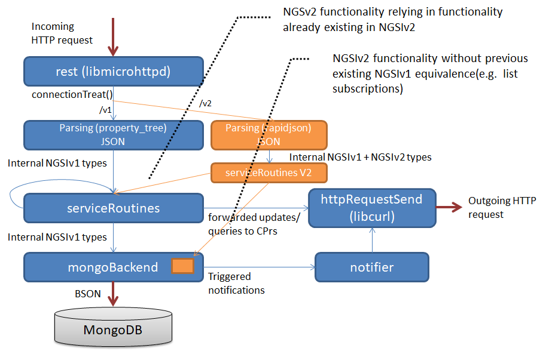
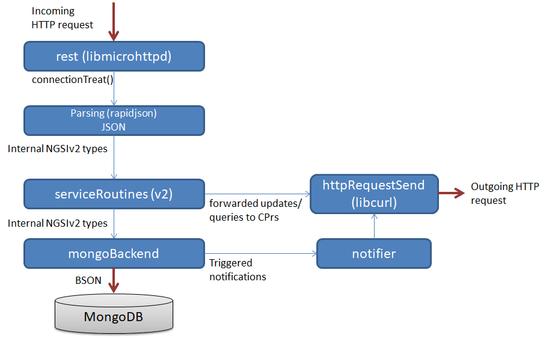

# High level internal architecture

## Overview

This document provides a high level introduction of the Orion Context Broker internal architecture that may be useful as introduction before going into the details of [the different libraries](sourceCode.md). However, note this is just an overview and it is not exhaustive (i.e. only the main libraries are mentioned here).

The following figure shows the main information flow and how program control passes from one module to another. For a more detailed list of internal flows see [this section](flowsIndex.md).

_Orion current internal architecture_

* Orion Context Broker starts an HTTP server at starting time, which listens for incoming requests. The [**rest** library](sourceCode.md#srclibrest) deals with such requests. Each requests. It is based in the [microhttpd](https://www.gnu.org/software/libmicrohttpd/) external library, which spawns a new thread per request.

* The `connectionTreat()` function is the entry point for new requests (see [RQ-01 diagram](sourceCode.md#flow-rq-01) for details). Depending of the version of the NGSI API to which the request belongs (basically, depending whether the request URL prefix is `/v1` or `/v2`) the execution flow goes to a different "branch" of the execution logic.

* In the case of NGSIv1 requests, the logic is as follows:
	* First, the [**jsonParse** library](sourceCode.md#srclibjsonparse) takes the request payload as input and generated a set of objects. The NGSIv1 parsing logic is based in [Boost library property_tree](https://theboostcpplibraries.com/boost.propertytree).
	* Next, a function is called to process the request. Each request type (in terms of HTTP and URL pattern) has a separate function. We name this function as "service routine" and it is part of the [**serviceRoutines** library](sourceCode.md#srclibserviceroutines). Note that some "high level" service routines may call another "low level" service routines.
	* At the end (either in one hop or two, see [the mapping document](ServiceRoutines.txt) for details), the service routine calls to **mongoBackend** library.
* In the case of NGSIv2 erquests, the logic is as follows:
	* First, the [**jsonParseV2** library](sourceCode.md#srclibjsonparsev2) takes the request payload as input and generated a set of objects. The NGSIv1 parsing logic is based in [rapidjson](http://rapidjson.org).
	* Next, in a similar way than NGSIv1, a service routine is called to process the request. Each request type (in terms of HTTP and URL pattern) has a service routine. They are included in the [**serviceRoutinesV2** library](sourceCode.md#srclibserviceroutinesv2). Note that some V2 service routines may call another V1 service routines (see [the mapping document](ServiceRoutines.txt) for details).
	* At the end **mongoBackend** library is invoked. Depending the case, this can be done directly from a V2 service routine or indirectly from a V1 service routine, as shown in the above figure.
* The [**mongoBackend** library](sourceCode.md#srclibmongobackend) is in some way the "brain" of Orion. It contains a set of functions, aimed at the different operations that Orion may perform (e.g. retrieve entity information, update entities, create a subscription, etc.). This library interfaces with the MongoDB using the corresponding [MongoDB C++ driver](http://mongodb.github.io/mongo-cxx-driver/). For historic reasons, most of the MongoDB backend is NGSIv1-based (thus, accessed from V1 service routines). The exceptions are those operations that are NGSIv2-only (e.g. subscription listing), thus they are invoked directly from V2 service routines.
* Whenever a notification is triggered (e.g. as a consequence of updating an entity covered by an existing subscription) the notifier module (which corresponds with the [**ngsiNotify** library](sourceCode.md#srclibngsinotify) is invoked from **mongoBackend** in order to send such notification. 
* The `httpRequestSend()` function (part of the **rest** library) is in charge of sending HTTP requests. It is based in the [libcurl](https://curl.haxx.se/libcurl/) external library. This functions is called either by the notifier module (to send notifications) or by some **serviceRoutines** function that may forward queries/updates to [Context Providers](../user/context_providers.md) under some conditions.

[Top](#top)

## A little bit of history...

The first version of Orion Context Broker (0.1.0) was released on May 14th, 2013. It was NGSIv1-pure and based only in XML as request/response payload format. At that moment, property_tree was chosen as parsing library as fitted well with the string-based nature of XML (in XML we don't have numbers, boolean, etc. as native types, as we have in JSON).

The next important milestone (from an architectural point of view) was the addition of JSON rendering, requested by a large community of Orion users. That work started around version 0.8.1 (October 30th, 2013) and ended in 0.10.0 (February 20th, 2014). Fortunately, the property_tree parser also supported JSON so there wasn't any significant impact in the architectural design (although we needed to write a big bunch of parsing/rendering logic for the new JSON format).

In July 2016 we introduced NGSIv2 (first version of Orion with NGSIv2 functionality, yet in beta status, was 0.23.0), a simpler and enhanced version of NGSIv1. NGSIv2 brought an important requirement for the parsing logic: it must support JSON native types. Thus, property_tree didn't sufficed and we need to chose a different library for doing the task. The new parsing library **jsonParseV2** (based in rapidjson) was developed to do that. For the same price, rapidjson introduced a simpler programming model and is [one of the more efficient existing ones](https://github.com/miloyip/nativejson-benchmark).

NGSIv2 also brought a new bunch of HTTP requests to implement (all the ones under the `/v2` URL prefix) so we developed a new **serviceRoutinesV2** library to hold the new associated service routines. In some cases, we were able to reuse functionality from NGSIv1 (thus some V2 service routines invoke V1 service routines). However, for new functionality without correspondence in NGSIv1 (e.g. list subscriptions) the V2 service routine calls directly to **mongoBackend** library (which needed to be extended with new functions to deal with that functionality).

Note that in the architecture figure above the new additions related with NGSIv2 are highlighted in orange.

Another architectural evolution (this time related with communications) was passing from dealing with outgoing HTTP request directly (i.e. writing the request directly in the TCP socket) to using libcurl as full-fledged HTTP oriented library. This was done in Orion 0.14.1 (August 1st, 2014). That way we unsure that all the subtle details of the HTTP protocol are taken into account (in fact, Orion 0.14.1 solved [problems sending notifications to some backends](https://github.com/telefonicaid/fiware-orion/issues/442)).

## Target architecture

One of the success of our architectural evolution has been to be able to develop an entire new version of the API (NGSIv1) keeping at the same time full backward compatibility with NGSIv1 API (except by the XML rendering, that was declared obsolete and finally removed in Orion 1.0.0... leaving property_tree an an awful legacy behind it :)

However, this has lead to a "parallel" architecture with some inefficient aspects (in particular, the "chain" of service routine invocations, instead of a more direct flow toward the **mongoBackend**). Thus, it should be consolidated in some moment, once NGSIv1 was declared deprecated and the target of Orion would be to support only NGSIv2 (in a similar way XML rendering was deprecated and finally removed).

Once that moment comes, the steps (from a high level perspective) would be as follow:

1. Remove NGSIv1 JSON functionality and adjust functional tests. That's include remove the property_tree dependency at all.
2. Consolidate NGSIv2 and NGSIv1 internal types in a single NGSI types family
3. Adapt **serviceRoutines** and **mongoBackend** to the single NGSI types family

The following picture shows that target architecture, taking into account the changes described above:

_Orion target internal architecture_

[Top](#top)
