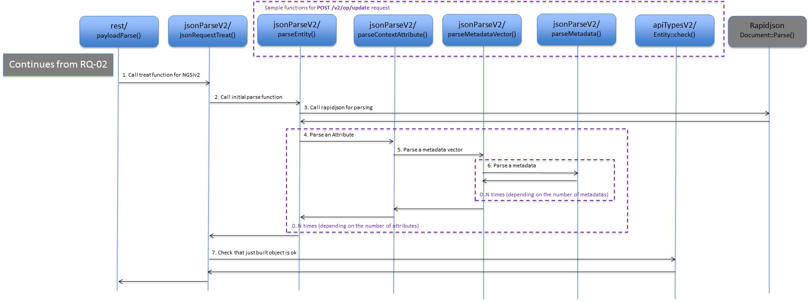

# JSON Parse NGSIv2
NGSIv2 payloads are parsed in a very different manner than NGSIv1 payloads.  
Instead of the centralized approach of NGSIv1 parse, an individual approach is used.
The advantage of this approach is that the code is much easier to understand and the inconvenient is that some tasks,
e.g. checks for unsupported fields is spread out in many different functions and this way it is easy for some of these checks to be forgotten.
The development team prefers this second approach however.
To describe the flow of NGSIv2 parse, we need an example payload as the code is not generic but individual per request type.
The request POST /v2/entities is used in this example flow

_Figure PP-03_  

* payloadParse calls the NGSIv2 parse function for JSON payloads `jsonRequestTreat()` (Point 1).
    jsonRequestTreat contains a switch on request types and calls the initial parse function for the type of the request.
* In this example, the request type is EntitiesRequest and the initial parse function is parseEntity (Point 2).
* In **Point 3**. rapidjson is invoked to parse the entire payload and return a tree of nodes that is now to be converted into an NGSI structure that Orion understands.  
    The method used for parsing is: `rapidjson::Document::Parse()`.
* parseEntity extracts the `Entity::Id`, `Entity::Type`, etc and then calls the underlying function for each attribute: `parseContextAttribute()` in **Point 4**.
    `parseContextAttribute()` extracts `Attribute::name`, type, etc and then:
* calls the underlying function `parseMetadataVector()` if any metadata are present (Point 5).
* `parseMetadataVector()` calls `parseMetadata()` once for each metadata found in the vector (Point 6)
* After the parse is ready, the NGSI object is verified to be correct by calling the `check()` method for the object (Point 7)
