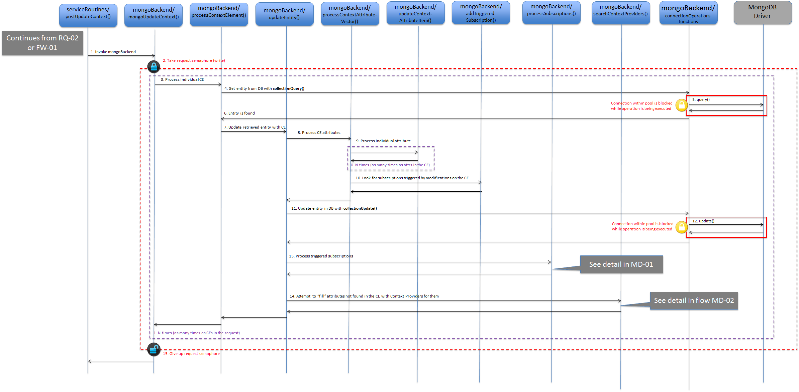
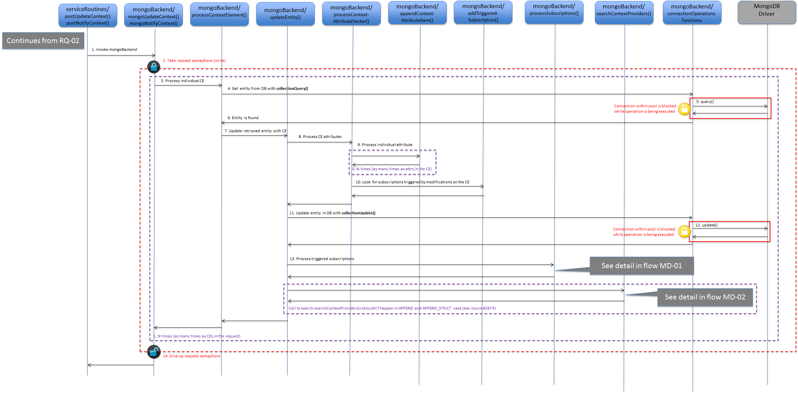
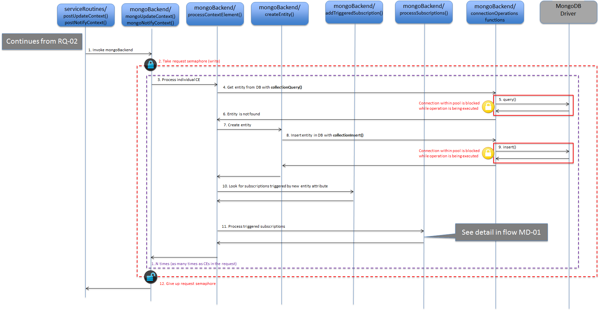
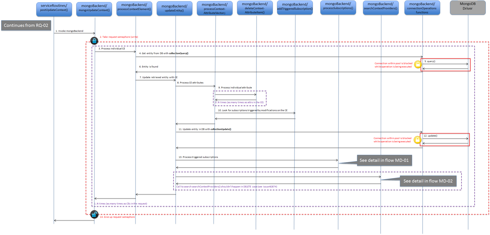
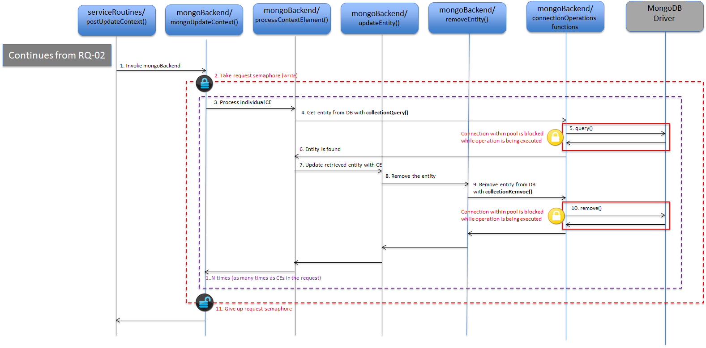
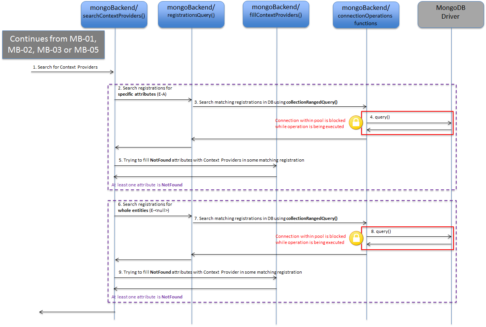
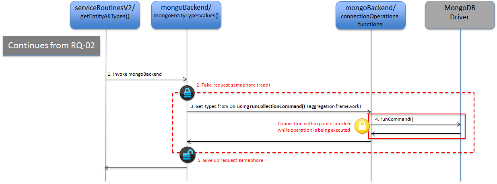
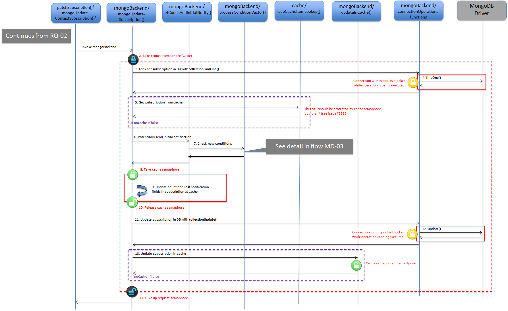
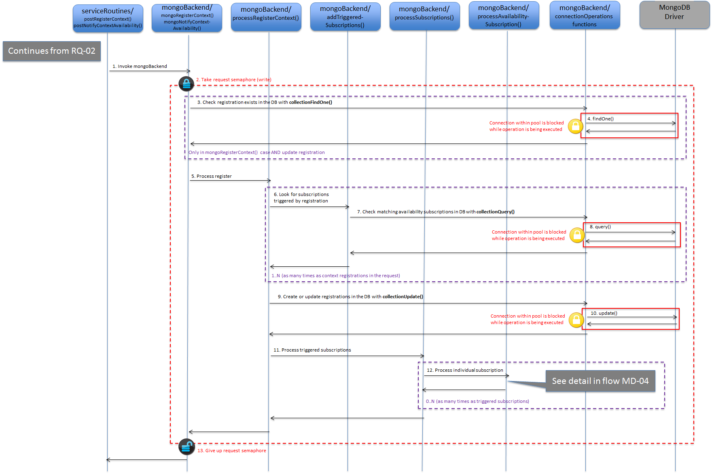
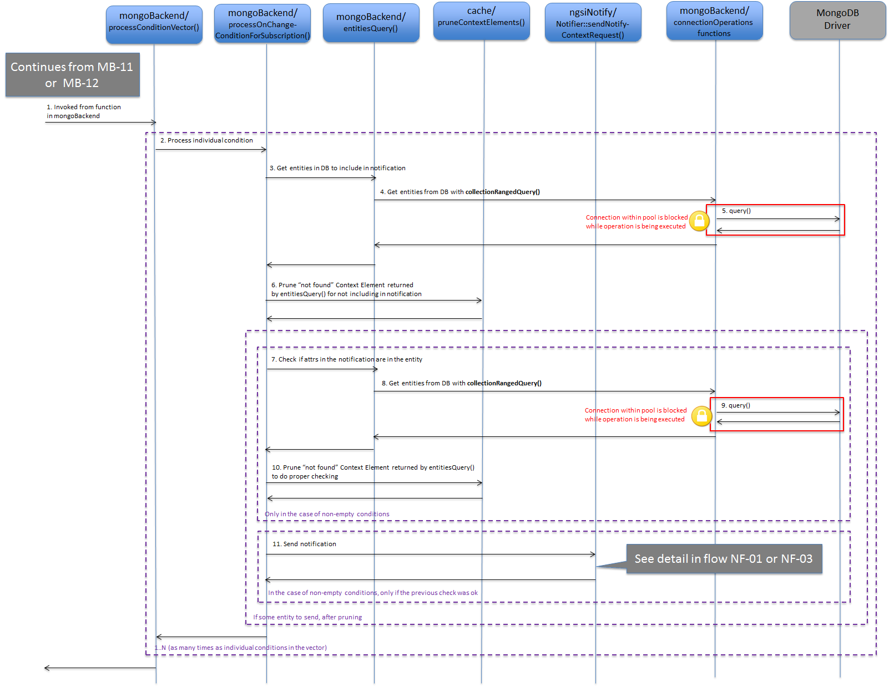

# <a name="top"></a>mongoBackend library

* [Introduction](#introduction)
* [Request processing modules](#request-processing-modules)
	* [`mongoUpdateContext` (SR) and `mongoNotifyContext` (SR)](#mongoupdatecontext-sr-and-mongonotifycontext-sr)
	* [`mongoQueryContext` (SR)](#mongoquerycontext-sr)
	* [`mongoQueryTypes` (SR and SR2)](#mongoquerytypes-sr-and-sr2)
	* [`mongoCreateSubscription` (SR2)](#mongocreatesubscription-sr2)
	* [`mongoUpdateSubscription` (SR2)](#mongoupdatesubscription-sr2)
	* [`mongoGetSubscriptions` (SR2)](#mongogetsubscriptions-sr2)
	* [`mongoUnsubscribeContext` (SR and SR2)](#mongounsubscribecontext-sr-and-sr2)
	* [`mongoSubscribeContext` (SR)](#mongosubscribecontext-sr)
	* [`mongoUpdateContextSubscription` (SR)](#mongoupdatecontextsubscription-sr)
	* [`mongoRegisterContext` (SR) and `mongoNotifyContextAvailability` (SR)](#mongoregistercontext-sr-and-mongonotifycontextavailability-sr)
	* [`mongoDiscoverContextAvailability` (SR)](#mongodiscovercontextavailability-sr)
	* [`mongoSubscribeContextAvailability` (SR)](#mongosubscribecontextavailability-sr)
	* [`mongoUpdateContextAvailabilitySubscription` (SR)](#mongoupdatecontextavailabilitysubscription-sr)
	* [`mongoUnsubscribeContextAvailability` (SR)](#mongounsubscribecontextavailability-sr)
* [Connection pool management](#connection-pool-management)
* [Low-level modules related with DB interaction](#low-level-modules-related-with-db-interaction)
* [Specific purpose modules](#specific-purpose-modules)
* [The `MongoGlobal` module](#the-mongoglobal-module)
	* [`mongoInit()`](#mongoinit)
	* [`entitiesQuery()`](#entitiesquery)
	* [`registrationsQuery()`](#registrationsquery) 
	* [`processConditionVector()`](#processconditionvector)
	* [`processAvailabilitySubscription()`](#processavailabilitysubscription)

## Introduction

The **mongoBackend** library is where all the database interaction takes place. More than that, it is where most of the actual processing for the different operations exposed by Orion Context Broker takes place. In some sense is like the "brain" of Orion.

This library entry points are:

* From [serviceRoutines](README.md#srclibserviceroutines) and [serviceRoutinesV2](README.md#srclibserviceroutinesv2). Those are the most important entry points.
* Other entry points from other places as initialization routines and helpers methods

This library makes an extensive use of [MongoDB C++ driver](http://mongodb.github.io/mongo-cxx-driver/), for sending operations to database and dealing with BSON data (which is the basic structure datatype used by these operations). You should be familiar with this driver in order to understand how the library works.

This library is also related with the [cache](README.md#srclibcache) library (if cache is enabled, i.e. the global `noCache` bool variable is `false`). In two ways: 

* context creations/modificacion/removal modules modify cache content
* entity creation/update logic check the cache in order to look for triggering subscriptions

Note that cache only apllies to *context* subscriptions. The *context availability subscriptions* don't use any cache at all. 

Let's analyze the different modules included in this library in the following sections.

[Top](#top)

### Request processing modules

These modules implement the different Context Broker requests. They are called during the overall request processing flow by service routines libraries (either in the **serviceRoutines** or **serviceRoutinesV2** libraries). Next subsections describe each module (SR means the module is called from **serviceRoutines** and SR2 means the module is called from  **serviceRoutineV2**; note no module is called from *both* libraries).

This section also describes the `MongoCommonRegister` and `MongoCommonUpdate` which provide common functionality highly coupled with several other request processing modules. In particular:

* `MongoCommonRegister` provides common functionality to `mongoRegisterContext` and `mongoNotifyContextAvailability` modules.
* `MongoCommonUpdate` provides common functionality to `mongoUpdateContext` and `mongoNotifyContext`.

[Top](#top)

#### `mongoUpdateContext` (SR) and `mongoNotifyContext` (SR)

The `mongoUpdateContext` module provides the entry point for the update context operation processing logic (by means of the `mongoUpdateContext()` function defined in its header file) while `mongoNotifyContext` module provides the entry point for the context notification processing logic (by means of the `mongoNotifyContext()` function in its header file). However, given that a context  notification is processed in the same way than a update context of "APPEND" action type, both `mongoUpdateContext()` and `mongoNotifyContext()` are at the end basically wrappers for the `processContextElement()` function (single external function in the `MongoCommonUpdate` module), which does the work.

The execution flow in this module depends on some conditions. Thus, for the sake of clarity, we are going to describe it based on five different subcases.

* Case 1: action type is "UPDATE" or "REPLACE" and the entity is found.
* Case 2: action type is "UPDATE" or "REPLACE" and the entity is not found.
* Case 3: action type is "APPEND" or "APPEND_STRICT" on existing entity
* Case 4: action type is "APPEND" or "APPEND_STRICT" on not existing entity
* Case 5: action type is "DELETE" to partially delete some attributes in the entity
* Case 6: action type is "DELETE" to remove an entity 

Note that `mongoUpdateContext()` applies to the 6 cases, while `mongoNotifyContext()` applies to 3 and 4.

Case 1: action type is "UPDATE" or "REPLACE" and the entity is found.

<a name='flow-mb-01'></a>


_MB-01: mongoUpdate UPDATE/REPLACE case with entity found_  

* `mongoUpdateContext()` is invoked from the service routine (step 1).
* Depending on `-reqMutexPolicy`, request semaphore could be taken (write mode) (step 2). See [this document for details](semaphores.md#mongo-request-semaphore).
* A loop calls `processContextElement()` function for each `ContextElement` object (CE, in short) in the incoming request (step 3).
* After some pre-conditions checking, the `processContextElement()` function processes an individual CE. First, the entity corresponding to that CE is search in the DB, by means on the `collectionQuery()` function in the `connectionOperations` module (steps 4 and 5). Let's assume that the entity is found (step 6).
* The execution flow passes to the `updateEntity()` function, in charge of doing the entity update (step 7). `updateEntity()` in sequence passes the flow to `processContextAttributeVector()` in order to process the attributes in the CE (step 8).
* The `processContextAttributeVector()` implements a loop to call `updateContextAttributeItem()` in order to process each individual attribute in the CE (step 9). More detail regarding the strategy used to implement this processing next.
* Once the processing of the attributes ends, `processContextAttributesVector()` calls `addTriggeredSubscriptions()` function in order to detect subscription that could be triggered by the update operation (step 10). More detail on this next.
* Finally the control is returned to `updateEntity()` with invokes `collectionUpdate()` function in the `connectionOperations` module in order to actually update the entity at DB (steps 11 and 12).
* Next step is to send notifications triggered by the update operation, by the means of the `processSubscriptions()` function (step 13). More detail on this next (diagram [MD-01](#flow-md-01)).
* Finally, the `searchContextProviders()` function is called in order to try to find a suitable context provider for each attribute in the CE not found at DB (step 14). This information would be used by the calling service routine in order to potentially forward the update operation to context providers, as described in the [context providers documentation](cprs.md). More information on the `searchContextProviders()` implementation next (diagram [MD-02](#flow-md-02)).
* If request semaphore was taken in step 2, then it is released before returning to calling function (step 15).

Case 2: action type is "UPDATE" or "REPLACE" and the entity is not found.

<a name='flow-mb-02'></a>


_MB-02: mongoUpdate UPDATE/REPLACE case with entity not found_

* `mongoUpdateContext()` is invoked from the service routine (step 1)
* Depending on `-reqMutexPolicy`, request semaphore could be taken (write mode) (step 2). See [this document for details](semaphores.md#mongo-request-semaphore).
* A loop calls `processContextElement()` function for each `ContextElement` object (CE, in short) in the incoming request (step 3).
* After some pre-conditions checking, the `processContextElement()` function processes an individual CE. First, the entity corresponding to that CE is search in the DB, by means on the `collectionQuery()` function in the `connectionOperations` module (steps 4 and 5). Let's assume that the entity is not found (step 6).
* The `searchContextProviders()` function is called in order to try to find a suitable context provider for the entity (step 7). This information would be used by the calling service routine in order to potentially forward the update operation to context providers, as described in the [context providers documentation](cprs.md). More information on the `searchContextProviders()` implementation next (diagram [MD-02](#flow-md-02)).
* If request semaphore was taken in step 2, then it is released before returning to calling function (step 8).

Case 3: action type is "APPEND" or "APPEND_STRICT" on existing entity

<a name='flow-mb-03'></a>


_MB-03: mongoUpdate APPEND/APPEND_STRICT case with existing entity_

* `mongoUpdateContext()` or `mongoNotifyContext()` is invoked from the service routine (step 1)
* Depending on `-reqMutexPolicy`, request semaphore could be taken (write mode) (step 2). See [this document for details](semaphores.md#mongo-request-semaphore).
* A loop calls `processContextElement()` function for each `ContextElement` object (CE, in short) in the incoming request (step 3).
* After some pre-conditions checking, the `processContextElement()` function processes an individual CE. First, the entity corresponding to that CE is search in the DB, by means on the `collectionQuery()` function in the `connectionOperations` module (steps 4 and 5). Let's assume that the entity is found (step 6).
* The execution flow passes to the `updateEntity()` function, in charge of doing the entity update (step 7). `updateEntity()` in sequence passes the flow to `processContextAttributeVector()` in order to process the attributes in the CE (step 8).
* The `processContextAttributeVector()` implements a loop to call `appendContextAttributeItem()` in order to process each individual attribute in the CE (step 9). More detail regarding the strategy used to implement this processing next.
* Once the processing of the attributes ends, `processContextAttributesVector()` calls `addTriggeredSubscriptions()` function in order to detect subscription that could be triggered by the update operation (step 10). More detail on this next.
* Finally the control is returned to `updateEntity()` with invokes `collectionUpdate()` function in the `connectionOperations` module in order to actually update the entity at DB (steps 11 and 12).
* Next step is to send notifications triggered by the update operation, by the means of the `processSubscriptions()` function (step 13). More detail on this next (see diagram [MD-01](#flow-md-01)).
* Current version of the code calls `searchContextProviders()` function, as in case 1. This shouldn't be done in the "APPEND"/"APPEND_STRICT" case, as this operation is always processed locally and doesn't make sense to forward it to context providers. The fix is pending  (see [this issue](https://github.com/telefonicaid/fiware-orion/issues/2874)).
* If request semaphore was taken in step 2, then it is released before returning to calling function (step 14).

Case 4: action type is "APPEND" or "APPEND_STRICT" on not existing entity

<a name='flow-mb-04'></a>


_MB-04: mongoUpdate APPEND/APPEND_STRICT case with new entity_

* `mongoUpdateContext()` or `mongoNotifyContext()` is invoked from the service routine (step 1)
* Depending on `-reqMutexPolicy`, request semaphore could be taken (write mode) (step 2). See [this document for details](semaphores.md#mongo-request-semaphore).
* A loop calls `processContextElement()` function for each `ContextElement` object (CE, in short) in the incoming request (step 3).
* After some pre-conditions checking, the `processContextElement()` function processes an individual CE. First, the entity corresponding to that CE is search in the DB, by means on the `collectionQuery()` function in the `connectionOperations` module (steps 4 and 5). Let's assume that the entity is not found (step 6).
* The execution flow passes to the `createEntity()` in charge of creating the entity (step 7). The entity is actually created at DB by the means of `collectionInsert()` function in the `connectionOperations` module (steps 8 and 9).
* Control is returned to `processContextElement()`, which calls `addTriggeredSubscriptions()` function in order to detect subscription that could be triggered by the update operation (step 10). More detail on this next.
* Next step is to send notifications triggered by the update operation, by the means of the `processSubscriptions()` function (step 11). More detail on this next (see diagram [MD-01](#flow-md-01)).
* If request semaphore was taken in step 2, then it is released before returning to calling function (step 12). 

Case 5: action type is "DELETE" to partially delete some attributes in the entity

<a name='flow-mb-05'></a>


_MB-05: mongoUpdate DELETE not remove entity_

* `mongoUpdateContext()` is invoked from the service routine (step 1)
* Depending on `-reqMutexPolicy`, request semaphore could be taken (write mode) (step 2). See [this document for details](semaphores.md#mongo-request-semaphore).
* A loop calls `processContextElement()` function for each `ContextElement` object (CE, in short) in the incoming request (step 3).
* After some pre-conditions checking, the `processContextElement()` function processes an individual CE. First, the entity corresponding to that CE is searched in the DB, by means on the `collectionQuery()` function in the `connectionOperations` module (steps 4 and 5). Let's assume that the entity is found (step 6).
* The execution flow passes to the `updateEntity()` function, in charge of doing the entity update (step 7). `updateEntity()` in sequence passes the flow to `processContextAttributeVector()` in order to process the attributes in the CE (step 8).
* The `processContextAttributeVector()` implements a loop to call `deleteContextAttributeItem()` in order to process each individual attribute in the CE (step 9). More detail regarding the strategy used to implement this processing next.
* Once the processing of the attributes ends, `processContextAttributesVector()` calls `addTriggeredSubscriptions()` function in order to detect subscription that could be triggered by the update operation (step 10). More detail on this next.
* Finally the control is returned to `updateEntity()` with invokes `collectionUpdate()` function in the `connectionOperations` module in order to actually update the entity at DB (steps 11 and 12).
* Next step is to send notifications triggered by the update operation, by the means of the `processSubscriptions()` function (step 13). More detail on this next (see diagram [MD-01](#flow-md-01)).
* Current version of the code calls `searchContextProviders()` function, as in case 1. This shouldn't be done in the "DELETE" case, as this operation is always processed locally and doesn't make sense to forward it to context providers. The fix is pending  (see [this issue](https://github.com/telefonicaid/fiware-orion/issues/2874)).
* If request semaphore was taken in step 2, then it is released before returning to calling function (step 14). 

Case 6: action type is "DELETE" to remove an entity

<a name='flow-mb-06'></a>


_MB-06: mongoUpdate DELETE remove entity_

* `mongoUpdateContext()` is invoked from the service routine (step 1)
* Depending on `-reqMutexPolicy`, request semaphore could be taken (write mode) (step 2). See [this document for details](semaphores.md#mongo-request-semaphore). 
* A loop calls `processContextElement()` function for each `ContextElement` object (CE, in short) in the incoming request (step 3).
* After some pre-conditions checking, the `processContextElement()` function processes an individual CE. First, the entity corresponding to that CE is searched in the DB, by means on the `collectionQuery()` function in the `connectionOperations` module (steps 4 and 5). Let's assume that the entity is found (step 6).
* The execution flow passes to the `updateEntity()` function, in charge of doing the entity update (step 7). `updateEntity()` in sequence passes the flow to `removeEntity()` in order to do the actual entity removal (step 8).
* `removeEntity()` invokes `collectionRemove()` function in the `connectionOperations` module in order to actually remove the entity at DB (steps 9 and 10).
* If request semaphore was taken in step 2, then it is released before returning to calling function (step 11).

Next, we are going to describe some implementation aspects that are common to several of the cases described above.

Regarding the strategy used at `processContextAttributeVector()` to implement entity update, this function keeps several variables that hold a "delta" of modifications (to be applied to the entity at DB), in particular: 

* `toSet`: attributes that need add or updated to the entity `attrs` field at DB, using the [`$set` operator](https://docs.mongodb.com/manual/reference/operator/update/set).
* `toUnset`: attributes that  need to be removed from the entity `attrs` field at DB, using the [`$unset` operator](https://docs.mongodb.com/manual/reference/operator/update/unset).
* `toPush`: attribute names that need to be added  to the entity `attrsName` field at DB, using the [`$addToSet`](https://docs.mongodb.com/manual/reference/operator/update/addToSet) and [`$each`](https://docs.mongodb.com/manual/reference/operator/update/each) operators.
* `toPull`: attribute names that need to be removed from the `attrsName` field at DB, using the [`$pullAll` operator](https://docs.mongodb.com/manual/reference/operator/update/pullAll).
* `locAttr` and `geoJson` are related with modification in the geolocation information associated to the entity (entity `location` field at DB).

The update is based on "deltas" rather than is setting the whole `attrs` and `attrsName` due to several updates could be done concurrently at DB to the same entity (by different request threads in the same CB process or different CB processes running in different nodes in active-active configurations) and the `attrs/attrsName` set by one thread could ruin the `attrs/attrsName` for the other thread.

These variables are returned back to calling `updateEntity()` as output parameters, to be used in the entity update operation on the DB (as shown in the diagrams above)

In order to fill `toSet`, `toUnset`, etc. the `processContextAttributeVector()` process the attributes in the incoming CE in a loop. Execution for each attribute processing is delegated a per-attribute processing function:

* `updateContextAttributeItem()`, if action type is UPDATE or REPLACE. The function `updateAttribute()` is used internally as helper (which in sequence may use `mergeAttrInfo()` to merge the attribute information in the DB and in the incoming CE).
* `appendContextAttributeItem()`, if action type is APPEND or APPEND_STRICT. The function `appendAttribute()` is used internally as helper, passing the ball to `updateAttribute()` if the attribute already exists in the entity and it isn't an actual append.
* `deleteContextAttributeItem()`, if action type is DELETE. The function `deleteAttribute()` is used internally as helper.

During the update process, either in the case of new entities or updating existing ones, context subscription could be triggered, so notifications would be sent. In order to do so, the update logic keeps a `subsToNotify` to hold triggered subscription. The function `addTriggeredSubscriptions()`  is in charge of adding new triggered subscriptions to the map. Then, the function `processSubscriptions()` is in charge of actually sending the notifications once the process has ended, based on the content of `subsToNotify` map. Both `addTriggeredSubscriptions()` and `processSubscriptions()` invocations are shown in the context of the different execution flow cases in the diagrams above.

* `addTriggeredSubscriptions()`. Actually, there are two versions of this function (`addTriggeredSubscriptions()` itself is just a dispatcher): the `_cache()` version (which uses the subscriptions cache to check if a particular entity modification triggers some subscription) and `_noCache()` (which check `csubs` collection at DB in order to do the checking). Obviously, the version to use depends on whether cache is enabled or not, i.e. the value of the global `noCache` bool variable. The `_cache()` version uses internally the subscription cache semaphore (see [this document for details](semaphores.md#subscription-cache-semaphore)).
* `processSubscriptions()`. Apart from the `subsToNotify` map, another important parameter in this function is `notifyCerP`, which is the context element response (CER) that will be used to fill the notifications to send. In the case of new entities, this CER is build from the contents of the incoming CE in the update request. In the case of updating an existing entity, the logic start with CER and updates it at the same time the `toSet`, `toUnset`, etc. fields are build. In other words, the logic keeps always an updated CER as the CE attributes are being processed. The `updateAttrInNotifyCer()` (used in `updateContextAttributeItem()` and `updateContextAttributeItem()`) and `deleteAttrInNotifyCer()` (used in `deleteContextAttributeItem()`) are helper functions using to do this task. The detail is shown in the sequence diagram below.

<a name='flow-md-01'></a>


_MD-01: processSubscriptions function_
 
* `processSubscriptions()` is invoked (step 1). See diagrams [MB-01](#flow-mb-01), [MB-03](#flow-mb-03), [MB-04](#flow-mb-04) and [MB-05](#flow-mb-05). Then, a loop is implemented to process each individual triggered subscription.
* The `processOnChangeConditionForUpdateContext()` function is called (step 2), which in sequence uses the `Notifier` object (from [ngsiNotify](README.md#srclibngsinotify) library) in order to actually sent the notification (step 3). The detail is described in diagrams [NF-01](README.md#flow-nf-01) or [NF-03](README.md#flow-nf-03).
* Next steps are done only in the case a notification was actually sent. Depending on cache usage:
    * If cache is not being used, then the last notification time and count in DB are updated at DB, by the means of `collectionUpdate()` in the `connectionOperations` module (steps 4 and 5).
    * If cache is being used, then the subscription is retrieved from the cache calling `subCacehcItemLookup()` (step 7). Next, last notification time and count are modified in the subscription cache (there will be consolidated at DB in the next cache refresh, see details in [this document](subscriptionCache.md#subscription-cache-refresh)). The access to cache is protected by subscription cache semaphore (see [this document for details](semaphores.md#subscription-cache-semaphore)), which is taken and released in steps 6 and 8 respectively.

Finally, in the case of action type "UPDATE/REPLACE", the context update logic is able to "fill the gaps" for missing entities/attributes in the local database with Context Providers information. This is done by the `searchContextProviders()`. The detail is shown in the sequence diagram below.

<a name='flow-md-02'></a>


_MD-02: searchContextProviders function_

* `searchContextProviders()` is invoked (step 1). See diagrams [MB-01](#flow-mb-01), [MB-02](#flow-mb-02), [MB-03](#flow-mb-03) and [MB-05](#flow-mb-05). Apart from this entry points, note that `searchContextProviders()` can be also called from `updateEntity()` in the case of `processContextAttributeVector()` fail (which means that the entity wasn't actually modified locally, so it makes sense to search for Context Providers).
* If at least some attribute has the `found` flag set to `false`, a lookup for matching registrations based on specific attributes (i.e. in the form "E-A") is done, calling the `registrationsQuery()` function in the `MongoGlobal` module (step 2). This function search in the DB using the `collectionRangedQuery()` in the `connectionOperations` module (steps 3 and 4).
* Then, the `fillContextProviders()` function (in the `MongoGlobal` module) is called in order to attempt to fill the not found attributes with the matched registrations (step 5).
* If at least some attribute stills with the `found` flag set to `false` a new lookup round is done. This time, searching for whole entities, (i.e. in the "E-&lt;null&gt;" form). Again, the `registrationsQuery()` function is used (step 6). This function search in the DB using the `collectionRangedQuery()` in the `connectionOperations` module (steps 7 and 8).
* Then, the `fillContextProviders()` function (in the `MongoGlobal` module) is called again in order to attempt to fill the not found attributes with the new matched registrations (step 9).

[Top](#top)

#### `mongoQueryContext` (SR)

Encapsulates the logic for the query context operation.

The header file contains only a function named `mongoQueryContext()` which uses a `QueryContextRequest` object as input parameter and a `QueryContextResponse` as output parameter. Its work is to build the response object based on the request object and the entities (for locally retrieved information) and registrations (for "pointers" to Context Providers to be used in the forwarding logic in the calling **serviceRoutine**) existing in the database.

The detail is shown in the sequence diagram below.

<a name='flow-mb-07'></a>


_MB-07: mongoQueryContext_

* `mongoQueryContext()` is invoked from the service routine (step 1).
* Depending on `-reqMutexPolicy`, request semaphore could be taken (read mode) (step 2). See [this document for details](semaphores.md#mongo-request-semaphore).
* The execution flow passes to `entitiesQuery()` in the `MongoGlobal` module (step 3).
* The `entitiesQuery()` function basically searches for entities in the database (`entities` collection, [described as part of the database model in the administration documentation](../admin/database_model.md#entities-collection)). More information on this function can be found in the `MongoGlobal` module section. It relies on the `collectionRangedQuery()` function in the `connectionOperations` module in order to do the actual query in DB (steps 4, 5 and 6). After the query at DB, a part of the function annotates results in order to help in the Context Providers search done by the calling function, using the `found` attribute flag (see details in the source code). The result is then provided in a `ContextElementResponseVector` object, as output parameters.
* Steps 7 to 11 are done only in the case no entity was found in DB and are related with context providers lookup.  
   * A lookup for matching registrations based on specific attributes (i.e. in the form "E-A") is done, calling the `registrationsQuery()` function in the `MongoGlobal` module (step 7). This function searches in the DB using the `collectionRangedQuery()` in the `connectionOperations` module (steps 8 and 9).
   * The `processGenericEntities()` function is called in order to add context providers corresponding to generic entities (step 10).
   * A loop on generic entities is implemented in order to add context provider for each such entity, by the means of the `addContextProviders()` function (step 11).
* Steps 12 to 17 are done only in the case at least some attribute has the `found` flag set to `false`.
   * A lookup for matching registrations based on specific attributes (i.e. in the form "E-A") is done, calling the `registrationsQuery()` function in the `MongoGlobal` module (step 12). This function searches in the DB using the `collectionRangedQuery()` in the `connectionOperations` module (steps 13 and 14).
   * Then, the `fillContextProviders()` function (in the `MongoGlobal` module) is called in order to attempt to fill the not found attributes with the matched registrations (step 15).
   * The `processGenericEntities()` function is called in order to add context providers corresponding to generic entities (step 16).
   * A loop on generic entities is implemented in order to add context provider for each such entity, by the means of the `addContextProviders()` function (step 17). 
* Steps 18 to 21 are done only in the case at least some attribute stills with the `found` flag set to `false`.
   * A lookup for matching registrations based on whole entities (i.e. in the form "E-&lt;null&gt;") is done, calling the `registrationsQuery()` function in the `MongoGlobal` module (step 18). This function searches in the DB using the `collectionRangedQuery()` in the `connectionOperations` module (steps 19 and 20).
   * Then, the `fillContextProviders()` function (in the `MongoGlobal` module) is called in order to attempt to fill the not found attributes with the matched registrations (step 21).
* Steps 22 to 25 are done only in the case the request used a null list of attributes, i.e. querying for the whole entity.
   * A lookup for matching registrations with empty attribute list is done, calling the `registrationsQuery()` function in the `MongoGlobal` module (step 22). This function searches in the DB using the `collectionRangedQuery()` in the `connectionOperations` module (steps 23 and 24).
   * Context providers are added directly, by the means of `addContextProviders()` function (step 25).
* A "prunning" step is done in order to remove not found elements (i.e. no result from local DB neither context provider). This is done by the `pruneContextElements()` function in the `MongoGlobal` module (step 26).
* If request semaphore was taken in step 2, then it is released before returning to calling function (step 27). 

By *generic entities* above we mean one of the following:

1. Entities with regular id (i.e. not a pattern) and null type
2. Entities with pattern id and not null type
3. Entities with pattern id and null type

[Top](#top)

#### `mongoQueryTypes` (SR and SR2)

Encapsulates the logic for the different operations in the NGSIv1 and NGSIv2 APIs that allow type browsing.

The header file contains three functions:

* `mongoEntityTypes()` (SR and SR2): it serves the `GET /v1/contextTypes` and `GET /v2/types` (without `options=values`) operations.
* `mongoEntityTypesValues()` (SR2): it servers the `GET /v2/types?options=values` operation.
* `mongoAttributesForEntityType()` (SR and SR2): it servers the `GET /v1/contextTypes/{type}` and `GET /v2/types/{type}` operations.

The detail for `mongoEntityTypes()` is as shown in the following diagram.

<a name='flow-mb-08'></a>


_MB-08: mongoEntityTypes_

* `mongoEntityTypes()` is invoked from the service routine (step 1). This can be from either `getEntityTypes()` (which resides in `lib/serviceRoutines/getEntityTypes.cpp`) or `getEntityAllTypes()` (which resides in `lib/serviceRoutinesV2/getEntityAllTypes.cpp`).
* Depending on `-reqMutexPolicy`, request semaphore could be taken (read mode) (step 2). See [this document for details](semaphores.md#mongo-request-semaphore). 
* A list of entity types and attributes belonging each type is retrieved from DB, using the `runCollectionCommand()` function in the `connectionOperations` module to run an aggregation command (steps 3 and 4).
* If attribute detail is enabled (i.e. `noAttrDetail` set to `false`) a loop iterates on every attribute of every entity type, in order to:
   * Invoke `getAttributeTypes()` to get the different types of the attribute (along the entities of the same entity type) (step 5).
   * The information is retrieved from DB using `collectionQuery()` function in the `connectionsOperation` module (steps 6 and 7).
* If request semaphore was taken in step 2, then it is released before returning to calling function (step 8). 

The detail for `mongoEntityTypesValues()` is as shown in the following diagram.

<a name='flow-mb-09'></a>


_MB-09: mongoEntityTypesValues_

* `mongoEntityTypesValues()` is invoked from the service routine (step 1)
* Depending on `-reqMutexPolicy`, request semaphore could be taken (read mode) (step 2). See [this document for details](semaphores.md#mongo-request-semaphore).
* A list of entity types is retrieved from DB, using the `runCollectionCommand()` function in the `connectionOperations` module to run an aggregation command (steps 3 and 4).
* If request semaphore was taken in step 2, then it is released before returning to calling function (step 5). 

The detail for `mongoAttributesForEntityType()` is as shown in the following diagram.

<a name='flow-mb-10'></a>


_MB-10: mongoAttributesForEntityType_

* `mongoAttributesForEntityType()` is invoked from the service routine (step 1). This can be from either `getEntityType()` (which resides in `lib/serviceRoutinesV2/getEntityType.cpp`) or `getAttributesForEntityType()` (which resides in `lib/serviceRoutines/getAttributesForEntityType.cpp`).
* Depending on `-reqMutexPolicy`, request semaphore could be taken (read mode) (step 2). See [this document for details](semaphores.md#mongo-request-semaphore). 
* A list of entity attributes corresponding to the entity type is retrieved from DB, using the `runCollectionCommand()` function in the `connectionOperations` module to run an aggregation command (steps 3 and 4).
* If attribute detail is enabled (i.e. `noAttrDetail` set to `false`) a loop iterates on every attribute in order to:
   * Invoke `getAttributeTypes()` to get the different types of the attribute (along the entities of the same entity type) (step 5).
   * The information is retrieved from DB using `collectionQuery()` function in the `connectionsOperation` module (steps 6 and 7).
* If request semaphore was taken in step 2, then it is released before returning to calling function (step 8).

These functions use `EntityTypeVectorResponse` (two first cases) and `EntityTypeResponse` objects in order to return results to calling service routine.

Note the usage of `noAttrDetails` parameter in `mongoEntityTypes()` and `mongoAttributesForEntityType()` in order to avoid a (potentially costly) process to get types of the attributes associated to an entity type (implemented by the `getAttributeTypes()` function).

All the above functions heavily relies in the MongoDB aggregation framework. You should be familiar with this framework (and with the `entities` collection structure, [described as part of the database model in the administration documentation](../admin/database_model.md#entities-collection)) in order to understand how they work.

[Top](#top)

#### `mongoCreateSubscription` (SR2)

Encapsulates the context subscription creation logic.

The header file contains only a function named `mongoCreateSubscription()` which work is basically to get the information from a `Subscription` object and insert the corresponding document at `csubs` collection at DB ([described as part of the database model in the administration documentation](../admin/database_model.md#csubs-collection)). The new subscription is also inserted in the cache (if cache is enabled).

<a name='flow-mb-11'></a>


_MB-11: mongoCreateSubscription_

* `mongoCreateSubscription()` is invoked from the service routine (step 1). This can be from either `postSubscriptions()` (which resides in `lib/serviceRoutinesV2/postSubscriptions.cpp`) or `mongoSubscribeContext()` (which resides in `lib/mongoBackend/mongoSubscribeContext.cpp`).
* Depending on `-reqMutexPolicy`, request semaphore could be taken (write mode) (step 2). See [this document for details](semaphores.md#mongo-request-semaphore).  
* This functions builds a BSON object that will be at the end the one to be persisted at DB, using different `set*()` functions (`setExpiration()`, `setHttpInfo()`, etc.). One of such function has the "side effect" of potentially sending initial notifications corresponding to the subscription being created, i.e. the `setCondsAndInitialNotify()` function (called in step 3).
* This function in sequence uses `processConditionVector()` to actually send notifications (step 4), which detail is described as part of `MongoGlobal` module section (see diagram [MD-03](#flow-md-03)).
* The BSON object corresponding to the new subscription is inserted in the DB using the `collectionInsert()` function in the `connectionOperations` module (steps 5 and 6).
* In the case cache is enabled  (i.e. `noCache` set to `false`) the new subscription is inserted in the cache (step 7). The `insertInCache()` function uses the subscription cache semaphore internally (see [this document for details](semaphores.md#subscription-cache-semaphore)).
* If request semaphore was taken in step 2, then it is released before returning to calling function (step 8). 

Note that potential notifications are sent before inserting the subscription at DB/cache, so the correct information regarding last notification times and count is taken into account.

[Top](#top)

#### `mongoUpdateSubscription` (SR2)

Encapsulates the context subscription update logic.

The header file contains only a function named `mongoUpdateSubscription()` which work is basically to get the information from a `mongoUpdateSubscription` object and use it to update the corresponding document at `csubs` collection at DB ([described as part of the database model in the administration documentation](../admin/database_model.md#csubs-collection)). The subscription is also updated in the cache (if cache is enabled).

<a name='flow-mb-12'></a>


_MB-12: mongoUpdateSubscription_

* `mongoUpdateSubscription()` is invoked from the service routine (step 1). This can be from either `patchSubscription()` (which resides in `lib/serviceRoutinesV2/patchSubscription.cpp`) or `mongoUpdateContextSubscription()` (which resides in `lib/mongoBackend/mongoUpdateContextSubscription.cpp`).
* Depending on `-reqMutexPolicy`, request semaphore could be taken (write mode) (step 2). See [this document for details](semaphores.md#mongo-request-semaphore). 
* Subscription to be updated is retrieved from DB using the `collectionFindOne()` function in the `connectionOperations` module (steps 3 and 4).
* If the cache is enabled (i.e. `noCache` set to `false`) the subscription cache object is also retrieved from cache using the `subCacheItemLoopkup()` function in the `cache` module (step 5). This should be protected by the cache semaphore, but currently it isn't (see [this issue](https://github.com/telefonicaid/fiware-orion/issues/2882) for details).
* The BSON object of the final subscription is built, based in the BSON object of the original subscription, using different `set*()` functions similar to the ones in the create subscription case (`setExpiration()`, `setHttpInfo()`, etc.). One of such function has the "side effect" of potentially sending initial notifications corresponding to the subscription being updated, i.e. the `setCondsAndInitialNotify()` function (called in step 6).
* This function in sequence uses `processConditionVector()` to actually send notifications (step 7), which detail is described as part of `MongoGlobal` module section (see diagram [MD-03](#flow-md-03)).
* The update count and last notification fields are updated in the subscription cache (step 9). This operation is protected by the cache semaphore (see [this document for details](semaphores.md#subscription-cache-semaphore)) which is taken and released in steps 8 and 10 receptively.
* The BSON object corresponding to the updated subscription is updated in the DB using the `collectionUpdate()` function in the `connectionOperations` module (steps 11 and 12).
* In the case cache is enabled  (i.e. `noCache` set to `false`) the new subscription is updated in the cache (step 13). The `updatetInCache()` function uses the subscription cache semaphore internally.
* If request semaphore was taken in step 2, then it is released before returning to calling function (step 14). 

Note that potential notifications are sent before updating the subscription at DB/cache, so the correct information regarding last notification times and count is taken into account.

[Top](#top)

#### `mongoGetSubscriptions` (SR2)

Encapsulates the logic for getting subscriptions.

The header file contains two functions `mongoGetSubscription()` (to get individual subscriptions,by id) or `mongoListSubscriptions()` (to get all subscriptions). They return a `Subscription` object (or a vector of `Subscription` objects, in the case of get all) with the result.

In both cases the implementation is based on a query on the `csubs` collection ([described as part of the database model in the administration documentation](../admin/database_model.md#csubs-collection)).

Regarding `mongoGetSubscription()`:

<a name='flow-mb-13'></a>


_MB-13: mongoGetSubscription_

* `mongoGetSubscription()` is invoked from the service routine (step 1).
* Depending on `-reqMutexPolicy`, request semaphore could be taken (read mode) (step 2). See [this document for details](semaphores.md#mongo-request-semaphore). 
* The subscription is retrieved from DB using the `collectionQuery()` function in the `connectionOperations` module (steps 3 and 4).
* Several `set*()` functions are used in order to fill the `Subscription` object to return. Among them (details in source code) we highly `setNotification()` (step 5), due to it uses the subscription cache semaphore internally (see [this document for details](semaphores.md#subscription-cache-semaphore)).
* If request semaphore was taken in step 2, then it is released before returning to calling function (step 6). 

Regarding `mongoListSubscriptions()`:

<a name='flow-mb-14'></a>


_MB-14: mongoListSubscriptions_

* `mongoListSubscriptions()` is invoked from the service routine (step 1).
* Depending on `-reqMutexPolicy`, request semaphore could be taken (read mode) (step 2). See [this document for details](semaphores.md#mongo-request-semaphore). 
* The subscription is retrieved from DB using the `collectionRangedQuery()` function in the `connectionOperations` module (steps 3 and 4).
* For each one of the subscriptions to return, several `set*()` functions are used in order to fill the `Subscription` objects. Among them (details in source code) we highly `setNotification()` (step 5), due to it uses the subscription cache semaphore internally (see [this document for details](semaphores.md#subscription-cache-semaphore)). 
* If request semaphore was taken in step 2, then it is released before returning to calling function (step 6). 

[Top](#top)

#### `mongoUnsubscribeContext` (SR and SR2)

Encapsulates the logic for unsubscribe context operation (NGSIv1) or remove subscription (NGSIv2).

The header file contains only a function named `mongoUnsubscribeContext()` which uses a `UnsubscribeContextRequest` object as input parameter and a `UnsubscribeContextResponse` as output parameter.

Its work is to remove from DB the document associated to the subscription in the `csubs` collection. The subscription is also removed from the cache (if cache is enabled).

<a name='flow-mb-15'></a>


_MB-15: mongoUnsubscribeContext_

* `mongoUnsubscribeContext()` is invoked from the service routine (step 1). This can be from either `postUnsubscribeContext()` (which resides in `lib/serviceRoutines/postUnsubscribeContext.cpp`) or `mongoUpdateContextSubscription()` (which resides in `lib/serviceRoutinesV2/deleteSubscription.cpp`).
* Depending on `-reqMutexPolicy`, request semaphore could be taken (write mode) (step 2). See [this document for details](semaphores.md#mongo-request-semaphore).
* The subscription is retrieved from DB using the `collectionFindOne()` function in the `connectionOperations` module (steps 3 and 4).
* The subscription is removed from DB using the `collectionRemove()` function in the `connectionOperations` module (steps 5 and 6).
* The subscription is also deleted from cache (steps 8 and 9). Cache access is protected by the subscription cache semaphore (see [this document for details](semaphores.md#subscription-cache-semaphore)), which is taken and released in steps 7 and 10 respectively.
* If request semaphore was taken in step 2, then it is released before returning to calling function (step 11). 

Note that steps 6 and 7 are done no matter the value of `noCache`. This works but it is inefficient. It should be fixed ([an issue](https://github.com/telefonicaid/fiware-orion/issues/2879) has been created about it).

[Top](#top)

#### `mongoSubscribeContext` (SR)

Encapsulates the logic for subscribe context (NGSIv1) operation.

The header file contains only a function named `mongoSubscribeContext()` which uses a `SubscribeContextRequest` object as input parameter and a `SubscribeContextResponse` as output parameter.

Actually, this function is a wrapper of the NGSIv2 version of this operation, i.e. the `mongoCreateSubscription()` in the [mongoCreateSubscription module](#mongocreatesubscription-sr2).

<a name='flow-mb-16'></a>


_MB-16: mongoSubscribeContext_

* `mongoSubscribeContext()` is invoked from the service routine (step 1).
* The execution flow is passed to `mongoCreateSubscription()` (setp 2). See diagram [MB-11](#flow-mb-11).

[Top](#top)

#### `mongoUpdateContextSubscription` (SR)

Encapsulates the logic for update context subscription (NGSIv1) operation.

The header file contains only a function named `mongoUpdateContextSubscription()` which uses a `UpdateContextSubscriptionRequest` object as input parameter and a `UpdateContextSubscriptionResponse` as output parameter.

Actually, this function is a wrapper of the NGSIv2 version of this operation, i.e. the `mongoUpdateSubscription()` in the [mongoUpdateSubscription module](#mongoupdatesubscription-sr2).

<a name='flow-mb-17'></a>


_MB-17: mongoUpdateContextSubscription_

* `mongoUpdateContextSubscription()` is invoked from the service routine (step 1).
* The execution flow is passed to `mongoUpdateSubscription()` (setp 2). See diagram [MB-12](#flow-mb-12).

[Top](#top)

#### `mongoRegisterContext` (SR) and `mongoNotifyContextAvailability` (SR) 

The `mongoRegisterContext` module provides the entry point for the register context operation processing logic (by means of the `mongoRegisterContext()` function defined in its header file) while `mongoNotifyContextAvailability` module provides the entry point for the context availability notification processing logic (by means of the `mongoNotifyContextAvailability()` function in its header file). However, given that a context availability notification is processed in the same way than a register context, both `mongoRegisterContext()` and `mongoNotifyContextAvailability()` are at the end basically wrappers for the `processRegisterContext()` function (single external function in the `MongoCommonRegister` module), which does the work consisting on creating a new registration or update an existing one in the `registrations` collection in the DB (([described as part of the database model in the administration documentation](../admin/database_model.md#registrations-collection))).

<a name='flow-mb-18'></a>


_MB-18: mongoRegisterContext_

* `mongoRegisterContext()` or `mongoNotifyContextAvailability` is invoked from the service routine (step 1).
* Depending on `-reqMutexPolicy`, request semaphore could be taken (write mode) (step 2). See [this document for details](semaphores.md#mongo-request-semaphore). 
* In the case of `mongoRegisterContext()` if a registration id was provided in the request, it means a registration update. Thus, the registrations document is retrieved from DB using the `collectionFindOne()` function in the `connectionOperations` module (steps 3 and 4).
* `processRegisterContext()` functions is called to process the registration (step 5).
* For each registration in the request, the `addTriggeredSubscriptions()` function is called (step 6). This function in sequence uses the `collectionQuery()` function in the `connectionOperations` in order to check if the registration triggers a subscription or not (steps 7 and 8). The `subsToNotify` map is used to store the triggered subscriptions.
* The registration document is created or updated in the DB. In order to to so the `collectionUpdate()` function in the `connectionOperations` module is used, setting the `upsert` parameter to `true` (steps 9 and 10).
* The `processSubscriptions()` function is called in order to process triggered subscriptions (step 11). The `subsToNotify` map is iterated in order to process each one individually, by `processAvailabilitySubscription()` (step 12). This process is described in diagram [MD-04](#flow-md-01).
* If request semaphore was taken in step 2, then it is released before returning to calling function (step 13).  

[Top](#top)

#### `mongoDiscoverContextAvailability` (SR)

Encapsulates the logic for the discover context availability (NGSIv1) operation.

The header file contains only a function named `mongoDiscoverContextAvailability()` which uses a `DiscoverContextAvailabilityRequest` object as input parameter and a `DiscoverContextAvailabilityResponse` as output parameter. Its work is to build the response object based on the request object and the registration existing in the database.

<a name='flow-mb-19'></a>


_MB-19: mongoDiscoverContextAvailability_

* `mongoDiscoverContextAvailability()` is invoked from service routine (step 1)
* Depending on `-reqMutexPolicy`, request semaphore could be taken (read mode) (step 2). See [this document for details](semaphores.md#mongo-request-semaphore). 
* Execution flow passes to `processDiscoverContextAvailability()` function (step 3)
* Registrations search is done using `registrationQuery()` function (steps 4). This function in sequence uses `collectionRangedQuery()` in order to retrieve registrations from DB (steps 5 and 6).
* If request semaphore was taken in step 2, then it is released before returning to calling function (step 7).  

[Top](#top)

#### `mongoSubscribeContextAvailability` (SR)

Encapsulates the context availability subscription creation logic.

The header file contains only a function named `mongoSubscribeContextAvailability()` which uses a `SubscribeContextAvailabilityRequest` object as input parameter and a `SubscribeContextAvailabilityResponse` as output parameter. Its work is to create a new context availability subscription in the `casubs` collection in the DB (([described as part of the database model in the administration documentation](../admin/database_model.md#casubs-collection))).

<a name='flow-mb-20'></a>


_MB-20: mongoSubscribeContextAvailability_

* `mongoSubscribeContextAvailability()` is invoked from the service routine (step 1).
* Depending on `-reqMutexPolicy`, request semaphore could be taken (write mode) (step 2). See [this document for details](semaphores.md#mongo-request-semaphore). 
* The context availability subscription document is created in the DB. In order to to so the `collectionInsert()` function in the `connectionOperations` module is used (steps 3 and 4).
* Eventually, some (one or more) notifications may be triggered as result of this creation. This is done by the `processAvailabilitySubscription()` function (step 5), which is described in diagram [MD-04](flow-md-04). 
* If request semaphore was taken in step 2, then it is released before returning to calling function (step 6). 

[Top](#top)

#### `mongoUpdateContextAvailabilitySubscription` (SR)

Encapsulates the update context availability subscription operation logic.

The header file contains only a function named `mongoUpdateContextAvailabilitySubscription()` which uses a `UpdateContextAvailabilitySubscriptionRequest` object as input parameter and a `UpdateContextAvailabilitySubscriptionResponse` as output parameter. Its work is to update the corresponding context availability subscription in the `casubs` collection in the DB (([described as part of the database model in the administration documentation](../admin/database_model.md#casubs-collection))).

<a name='flow-mb-21'></a>


_MB-21: mongoUpdateContextAvailabilitySubscription_

* `mongoUpdateContextAvailabilitySubscription()` is invoked from the service routine (step 1).
* Depending on `-reqMutexPolicy`, request semaphore could be taken (write mode) (step 2). See [this document for details](semaphores.md#mongo-request-semaphore). 
* The context availability subscription document to update is retrieved from DB, by the means of the `collectionFindOne()` function in the `connectionOperations` module (steps 3 and 4).
* The context availability subscription document is updated in the DB. In order to to so the `collectionUpdate()` function in the `connectionOperations` module is used (steps 5 and 6).
* Eventually, some (one or more) notifications may be triggered as result of this update. This is done by the `processAvailabilitySubscription()` function (step 7), which is described in diagram [MD-04](#flow-md-04).
* If request semaphore was taken in step 2, then it is released before returning to calling function (step 8). 

[Top](#top)

#### `mongoUnsubscribeContextAvailability` (SR)

Encapsulates the logic for unsubscribe context availability operation.

The header file contains only a function named `mongoUnsubscribeContextAvailability()` which uses a `UnsubscribeContextAvailabilityRequest` object as input parameter and a `UnsubscribeContextAvailabilityResponse` as output parameter.

Its work is to remove from DB the document associated to the subscription in the `casubs` collection.

<a name='flow-mb-22'></a>


_MB-21: mongoUnsubscribeContextAvailability_

* `mongoUnsubscribeContextAvailability()` is invoked from the service routine (step 1).
* Depending on `-reqMutexPolicy`, request semaphore could be taken (write mode) (step 2). See [this document for details](semaphores.md#mongo-request-semaphore). 
* The subscription is retrieved from DB using the `collectionFindOne()` function in the `connectionOperations` module (steps 3 and 4).
* The subscription is removed from DB using the `collectionRemove()` function in the `connectionOperations` module (steps 5 and 6).
* If request semaphore was taken in step 2, then it is released before returning to calling function (step 7). 

[Top](#top)

### Connection pool management

The module `mongoConnectionPool` manages the DB connection pool. How the pool works is important and deserves an explanation. Basically, Orion Context Broker keeps a list of connections to DB (the `connectionPool` defined at `mongoConnectionPool.cpp`). The list is sized with 
`-dbPoolSize` CLI parameter (10 by default). Each element in the list is an object of this class:

```
typedef struct MongoConnection
{
  DBClientBase*  connection;
  bool           free;
} MongoConnection;
```

where `connection` is the actual connection (`DBClientBase` is a class in the MongoDB driver) and `free` a flag to know if the connection is currently in use or not. This is important, as `DBClientBase` objects is not thread safe (see more detail in [this post at StackOverflow](http://stackoverflow.com/questions/33945987/thread-safeness-at-mongodb-c-driver-regarding-indirect-connection-usage-throug)) so Context Broker logic has to ensure that the same connections is not being used by two threads at the same time.

Taking this into account, the main functions within the `mongoConnectionPool` module are (there are more than that, but are secondary ones related with getting metrics logic):

* `mongoConnectionPoolInit()`: the one initializing the pool, called from the Context Broker bootstrapping logic.
* `mongoPoolConnectionGet()`: get a free connection from pool
* `mongoPoolConnectionRelease()`: release a connection, so it returns to the pool and it is ready to be selected again by next call of the `mongoConnectionGet()` function.

[Top](#top)

### Low-level modules related with DB interaction

* `connectionOperations`: wrapper for DB operations (such as insert, find, update, etc.), adding Orion specific aspects (e.g. concurrency management at the DB connection pool, error handling, logging, etc.). MongoDB driver methods to  interact with DB should not be used directly, but using this module (or expand it if you need an operation not yet covered).
* `safeMongo`: safe methods to get fields from BSON object. Direct access to BSON object using MongoDB driver methods should be avoided, use `safeMongo` module instead (or expand it if you need another way of accessing BSON information not yet covered).
* `dbConstants` (only `.h`): field names used at DB level (the same as described [in the database model documentation](../admin/database_model.md)) are defined here. 
* `dbFieldsEncoding` (only `.h`): helper function to do encoding at DB level and metadata string splitting.

[Top](#top)

### Specific purpose modules

* `MongoCommonSubscription`: common functions used by several other modules related with the subscription logic. Most of the functions this module contains are set functions to fill fields in `Subscriptions` objects.
* `location`: functions related with location management at DB.
* `mongoSubCache`: functions used by the [cache](README.md#srclibcache)]library to interact with DB.
* `compoundResponses` and `compoundValueBson`: they are modules that help in the conversion between BSON data and internal types (mainly in the [ngsi](README.md#srclibngsi) library) and viceversa.
* `TriggeredSubscription`: helper class used by subscriptions logic (both context and context availability subscriptions) in order to encapsulate the information related with a triggered subscription on context or registration creation/update.
 
[Top](#top)

### The `MongoGlobal` module

Finally, the  have the `MongoGlobal` module, which contains a set of helper functions, used by another **mongoBackend** modules or even other libraries. It has around 40 individual functions so it doesn't make sense to provide all the details in the present document. However, we can highlight the following ones.

[Top](#top)

#### `mongoInit()`

Used by CB initialization logic (at `ContextBroker.cpp` `main()`) in order to initialize DB pooled connection.

[Top](#top)

#### `entitiesQuery()`

This function basically searches for entities in the database (`entities` collection, [described as part of the database model in the administration documentation](../admin/database_model.md#entities-collection)). It takes into account service (also named "tenant"), service path, pagination and sorting parameters. The query for MongoDB is composed in several parts: entities, service path, attributes and scopes (filters and geo-location) 

It relies on the `collectionRangedQuery()` function in the `connectionOperations` module in order to do the actual query in DB. After the query at DB, a part of the function annotates results in order to help in the Context Providers search done by the calling function, using the `found` attribute flag (see details in the source code). The result is then provided in a `ContextElementResponseVector` object, as output parameters.

This function is called from the following places:

* From `mongoQueryContext()` (in the `mongoQuery` module), as the "core" of the query operation.
* `processOnChangeConditionForSubscription()`, to search the entities to "fill" initial notifications during context subscription creation/update.

[Top](#top)

#### `registrationsQuery()` 

This function basically searches for existing registrations in the database (`registrations` collection, [described as part of the database model in the administration documentation](../admin/database_model.md#registrations-collection)). It takes into account service (also named "tenant"), service path and pagination parameters. 

It is used from several places:

* From `mongoDiscoverContextAvailability()` (in the `mongoDiscoverContextAvailability` module), as "core" of the discovery operation.
* From `processAvailabilitySubscription()` (also part of the `MongoGlobal` module) in order to detect registrations that could trigger context availability notifications.
* From `mongoQueryContext()` in the `mongoQueryContext` module, in order to locate Context Providers that could be eventually used to forward the query. Note that the forwarding is not done within the **mongoBackend** library, but from the calling **serviceRoutine**.
* From `searchContextProviders()` in the `MongoCommonUpdate` module, in order to locate Context Providers that could be eventually used to forward the update. Note that the forwarding is not done within the **mongoBackend** library, but from the calling **serviceRoutine**.

[Top](#top)

#### `processConditionVector()`

This function is called at context subscription creation/update and eventually sent an initial notification associated to such subscription.

<a name='flow-md-03'></a>


_MD-03: processConditionVector function_

* `processConditionVector()` is invoked (step 1). See diagrams [MB-11](#flow-mb-11) and [MB-12](#flow-mb-12).
* A loop iterates on each individual condition in the `NotifyConditionVector` vector (although most of the times this vector has only one item):
   * The `processOnChangeConditionForSubscription()` is called to process the individual condition (step 2).
   * `entitiesQuery()` is called to get the entities to be included in the notification (step 3), which in sequence relies on `collectionRangedQuery()` in the `connectionOperations` module in order to get the entities from DB (steps 4 and 5).
   * The `pruneContextElements()` function is call in order to remove not found elements, as it doesn't make sense to include them in the notification (step 6).
   * If after pruning there is some entity to send, steps 7 to 11 are executed.
	   * In the case of conditions for particular attributes (i.e. not empty condition), then a second lookup is done using `entitiesQuery()` (steps 7, 8 and 9, plus prunning in step 10).
	   * Notification is sent (step 11) using the `Notifier` object (from [ngsiNotify](README.md#srclibngsinotify) library) in order to actually sent the notification (step 3). The detail is provided in diagrams [NF-01](README.md#flow-nf-01) or [NF-03](README.md#flow-nf-03). In the case of conditions for particular attributes, notification is sent only if the previous check was ok. In the case of all-attributes notifications (i.e. empty codition) notification is always sent.

Note `processOnChangeConditionForSubscription()` has a "sibling" function named `processOnChangeConditionForUpdateContext()` for non-initial notifications (see diagram [MD-01](#flow-md-01)).

[Top](#top)

#### `processAvailabilitySubscription()`

Similar to  `processOnChangeConditionForSubscription()` and   `processOnChangeConditionForUpdateContext()` this function is the one that effectively composes context availability notifications.

It is called from:
* Context availability creation/update logic, so an initial notification for all matching context registrations is sent.
* Register operations logic, when new (or updated) context registration matches an availability subscription

<a name='flow-md-04'></a>


_MD-04: processAvailabilitySubscription function_

* `processAvailabilitySubscription()` is invoked (step 1). See diagrams [MB-18](#flow-mb-18), [MB-20](#flow-mb-20) and [MB-21](#flow-mb-21).
* Check if some registration matches the subscription, using `registrationsQuery()` (step 2). This function in sequence uses `collectionRangeQuery()` in the `connectionOperations` module to check in the DB (steps 3 and 4).
* In the case of some registration matches, the process continues. Availability notification is sent (step 5) using the `Notifier` object (from [ngsiNotify](README.md#srclibngsinotify) library). The detail is described in diagram [NF-02](README.md#flow-nf-02).
* Finally, last notification and count statistics are updated, by calling `mongoUpdateCasubNewNotification()` (step 6). This function in sequence uses `collectionUpdate()` in the `connectionOperations` module in order to update the corresponding context availability subscription document in DB (steps 7 and 8).

[Top](#top)


